# SecX Automation Suite

**Compliance Baseline as Code | Hardening & Drift Automation**

[](LICENSE)
[](https://github.com/susunola/cis-os#suites)
[](https://www.python.org/)
[](https://github.com/PowerShell/PowerShell)

[English](README.md) | [简体中文](README.zh.md) | **日本語** | [ภาษาไทย](README.th.md)

10 種類の Linux ディストリビューションと 4 バージョンの Windows Server に対して **CIS** セキュリティベンチマークを実行する Ansible Playbook およびローカル CLI です。各スイートは `scan`（読み取り専用）と `apply`（修復）の 2 つのモードで動作し、構造化された監査ログ付きのインタラクティブな HTML レポートをホストごとに生成します。

**サポートプラットフォーム:** RHEL 8/9/10 · TencentOS 3/4 · SLES 15/16 · Ubuntu 20.04/22.04/24.04 LTS · Windows Server 2016/2019/2022/2025

## アーキテクチャ

<p align="center">
  
</p>

エンジンは単一ファイルのスクリプトであり、サードパーティの依存関係は一切ありません（Linux では Python 3、Windows では PowerShell）。Ansible はファイル転送、コマンド実行、レポートのレンダリングのみを担当します。各エンジンは、構造化された `result.json` と、準拠レビューや SIEM 取り込みに適したオプションの `audit.log`（JSON 行形式）の両方を生成します。

## ワークフロー

### scan（読み取り専用）

1. `preflight` — Ansible が変数を検証し、ターゲットに Python 3.6 以上（Windows では PowerShell 5.1 以上）が存在するか確認し、root / Administrator 権限を確認します。
2. `push` — `cis_engine.py`、`rules.json`、`guidance.json`、`sections.json` をターゲットの `/tmp/cis-scan/`（Windows では `C:\Windows\Temp\cis-scan`）にコピーします。
3. `run` — エンジンが `--mode scan` で起動し、カタログを走査して各ルールをチェックし、証跡を収集して `result.json` を書き込みます。ターゲット上の設定は一切変更されません。
4. `fetch` — Ansible が `result.json`（および有効な場合は `audit.log`）を制御マシンに取得します。
5. `report` — Jinja2 テンプレート（`report.html.j2`）が `result.json` とホスト情報（ホスト名、IP、MAC、OS、カーネル）を組み合わせて、インタラクティブな HTML レポートをレンダリングします。

### apply（修復）

手順 1、2、4、5 は scan と同一です。手順 3 のみ異なります。

3. エンジンが `--mode apply` で起動します。修復可能な既知のファミリに属する各失敗ルールについて、エンジンは元のファイルを `/var/backups/cis-<os>/` にバックアップし、設定を変更した後、ルールを再チェックして新しい状態を確認します。再起動やサービス再起動が必要なルールは、デフォルトではスキップされますが、`cis_allow_disruptive=true` が明示的に設定されている場合は実行されます。監査ログが有効な場合、すべてのアクションが記録されます。

レポートには、**Before**（以前のスキャン）と **After** のステータスが差分付きで表示されます。apply によって再スキャン時に新たな失敗が発生した場合、レポートはそれを「回帰（regressions）」ブロックに表示します。

## スイート

| スイート | ベンチマーク | エンジン | ルール数 |
|-------|-----------|--------|-------|
| `cis-tencentos3-ansible/` | CIS TencentOS Linux 3 v1.0.0 | Python 3 | 322 |
| `cis-tencentos4-ansible/` | CIS TencentOS Linux 4 v1.0.0 | Python 3 | 275 |
| `cis-rhel8-ansible/` | CIS Red Hat Enterprise Linux 8 v4.0.0 | Python 3 | 322 |
| `cis-rhel9-ansible/` | CIS Red Hat Enterprise Linux 9 v2.0.0 | Python 3 | 297 |
| `cis-rhel10-ansible/` | CIS Red Hat Enterprise Linux 10 v1.0.1 | Python 3 | 328 |
| `cis-sles15-ansible/` | CIS SLES 15 v2.0.1 | Python 3 | 286 |
| `cis-sles16-ansible/` | CIS SLES 16 v1.0.0 | Python 3 | 336 |
| `cis-ubuntu2004-ansible/` | CIS Ubuntu 20.04 LTS v3.0.0 | Python 3 | 312 |
| `cis-ubuntu2204-ansible/` | CIS Ubuntu 22.04 LTS v3.0.0 | Python 3 | 306 |
| `cis-ubuntu2404-ansible/` | CIS Ubuntu 24.04 LTS v2.0.0 | Python 3 | 332 |
| `cis-win2016-ansible/` | CIS Microsoft Windows Server 2016 v3.0.0 | PowerShell | 337 |
| `cis-win2019-ansible/` | CIS Microsoft Windows Server 2019 v3.0.0 | PowerShell | 338 |
| `cis-win2022-ansible/` | CIS Microsoft Windows Server 2022 v3.0.0 | PowerShell | 342 |
| `cis-win2025-ansible/` | CIS Microsoft Windows Server 2025 v2.1.0 | PowerShell | 360 |

各スイートは自己完結型の Ansible プロジェクトであり、独自のインベントリ、group_vars、`scan.yml`、`apply.yml`、ロールツリー、テンプレートを備えています。

## 監査ログ

`--audit-log` が設定されている場合、エンジンはルール実行ごとに 1 行の JSON を指定されたファイルに書き込み、構造化された追記安全な監査証跡を生成します。各エントリには以下が含まれます。

| フィールド | 説明 |
|-------|-------------|
| `ts` | ミリ秒精度の ISO-8601 UTC タイムスタンプ |
| `host` | ターゲットホスト名 |
| `version` | エンジンバージョン |
| `mode` | `scan` または `apply` |
| `profile` | `L1` または `L2` |
| `rule` | CIS ルール ID（例: `1.1.1.1`） |
| `title` | 人間が読めるルールタイトル |
| `status` | `pass`、`fail`、`manual`、`error`、`notapplicable` |
| `apply_status` | `applied`、`already`、`skipped_disruptive`、`failed`、`n/a` |
| `detail` | 証跡または修復サマリー（200 文字に切り詰め） |
| `duration_ms` | 実行時間（ミリ秒） |

**CLI 経由:**

```bash
python3 cis_cli.py scan --os rhel9 --audit-log output/audit-$(hostname).log
```

**Ansible 経由:** Playbook の実行時に `-e cis_audit_log=/var/log/cis-audit.log` を追加します。

監査ログの形式は改行区切りの JSON で、ログアグリゲータ、SIEM プラットフォーム、準拠監査人と互換性があります。

## クイックスタート

### ローカル CLI（推奨）

```bash
# L1 スキャン（読み取り専用）
python3 cis_cli.py scan --os rhel9 --profile L1 --output output/

# L1 適用（修復）
python3 cis_cli.py apply --os ubuntu2204 --profile L1 --output output/

# L2 フルスキャン + 破壊的ルール許可 + 監査ログ
python3 cis_cli.py apply --os tencentos4 --profile L2 --allow-disruptive \
  --audit-log output/audit.log --output output/

# 特定のルールのみをスキャン
python3 cis_cli.py scan --os sles15 --include "1.1.1,1.1.2,5.2" --output output/
```

`--os` の値: `tencentos3` `tencentos4` · `rhel8` `rhel9` `rhel10` · `sles15` `sles16` · `ubuntu2004` `ubuntu2204` `ubuntu2404` · `win2016` `win2019` `win2022` `win2025`

### Ansible 経由

```bash
ansible-playbook -i cis-rhel9-ansible/inventory/hosts.ini \
                 cis-rhel9-ansible/scan.yml

ansible-playbook -i cis-rhel9-ansible/inventory/hosts.ini \
                 cis-rhel9-ansible/apply.yml \
                 -e cis_profile=L2 -e cis_allow_disruptive=true
```

## きめ細かな実行制御

エンジンとラッパーは同じフィルタを共有します。

| パラメータ | 目的 |
|-----------|---------|
| `--mode scan` / `--mode apply` | 読み取り専用チェック / 修復 |
| `--profile L1` / `--profile L2` | ベースライン / 多層防御 |
| `--include 1.1.1,1.1.2,5.2` | 指定されたルールのみを実行 |
| `--exclude 1.5,1.6` | 指定されたルールをスキップ |
| `--sections 1,5` | ID が指定されたプレフィックスで始まるルールのみを実行 |
| `--families sysctl,kmod` | 指定された修復可能ファミリのルールのみを実行 |
| `--audit-log audit.log` | 構造化された監査証跡を書き込み |

Ansible を使用する場合、対応する変数は各スイートの README の「Key Variables」セクションに記載されています。

## 権限モード

SecX は 3 つの権限レベルをサポートします。`apply` は常に **root**（Linux）または **Administrator**（Windows）が必要です。

### scan — 各レベルで動作するもの（Linux）

| チェックカテゴリ | Root | 非 root + caps¹ | 一般ユーザー |
|-------------|------|-----------------|------------|
| パッケージ、サービス、プロセス | ✅ | ✅ | ✅ |
| ファイル権限（非 root ファイル） | ✅ | ✅ | ✅ |
| カーネルパラメータ（`/proc/sys/`） | ✅ | ✅² | ❌ |
| ファイル権限（root 専用ファイル） | ✅ | ✅³ | ❌ |
| SSH 設定（`sshd -T`） | ✅ | ✅⁴ | ❌ |
| 監査ルール（`auditctl -l`） | ✅ | ✅⁴ | ❌ |
| sudoers、shadow、ログ | ✅ | ✅³ | ❌ |

¹ "非 root + caps" = capability または sudo で特定権限を付与された一般ユーザー。
² `cap_sys_ptrace` が必要。³ `cap_dac_read_search` が必要。⁴ 特定コマンドの sudo が必要。

### 非 root スキャンユーザーの設定（Linux）

**方法 A — capability ベースのバイパス**（永続的；systemd ユニットまたは `/etc/security/capability.conf` に追加）：

```bash
sudo setcap cap_sys_ptrace,cap_dac_read_search+ep $(which python3)
```

**方法 B — 特定コマンドの sudo ルール**：

```
# /etc/sudoers.d/cis-scan
cis-scanner ALL=(ALL) NOPASSWD: /usr/sbin/sshd -T *
cis-scanner ALL=(ALL) NOPASSWD: /usr/sbin/auditctl -l
```

capabilities と 2 つの sudo コマンドを設定することで、非 root スキャンは約 95% のルールカバレッジを達成します。残りのギャップは apply 専用の操作（chown、chmod、モジュールロード、パーティションリサイズ）に限定されます。

### Windows

非 Admin ユーザーでも PowerShell 実行ポリシー `RemoteSigned` 以下でスキャン可能です。apply は Administrator が必要 — `-RunAsAdministrator` または Ansible `become: true` を使用してください。

## ディレクトリ構成

```
secx/
├── README.md
├── README.zh.md
├── README.ja.md
├── README.th.md
├── cis_cli.py                      # ローカル CLI（--os でターゲットを切り替え）
├── docs/architecture.svg           # アーキテクチャ図
├── cis-tencentos3-ansible/         # TencentOS 3
├── cis-tencentos4-ansible/         # TencentOS 4
├── cis-rhel8-ansible/              # RHEL 8
├── cis-rhel9-ansible/              # RHEL 9
├── cis-rhel10-ansible/             # RHEL 10
├── cis-sles15-ansible/             # SLES 15
├── cis-sles16-ansible/             # SLES 16
├── cis-ubuntu2004-ansible/         # Ubuntu 20.04 LTS
├── cis-ubuntu2204-ansible/         # Ubuntu 22.04 LTS
├── cis-ubuntu2404-ansible/         # Ubuntu 24.04 LTS
├── cis-win2016-ansible/            # Windows Server 2016
├── cis-win2019-ansible/            # Windows Server 2019
├── cis-win2022-ansible/            # Windows Server 2022
└── cis-win2025-ansible/            # Windows Server 2025
    ├── ansible.cfg
    ├── scan.yml | apply.yml | site.yml
    ├── inventory/  group_vars/
    ├── reports/                    # HTML / JSON / CSV / 監査出力
    └── roles/cis_<os>/
        ├── files/   engine、rules.json、guidance.json、sections.json
        ├── tasks/   preflight、run、report、gate
        └── templates/  report.html.j2、index.html.j2、findings.csv.j2
```

## レポート

各実行から 2 種類の HTML レポートが生成されます。いずれも静的で自己完結型、印刷対応、テーマ切り替え可能（ライト / ダーク）です。同じ Jinja2 + バニラ JS スタックを共有し、サードパーティのアセットを一切読み込まないため、完全にオフラインで動作します。

| レポート | テンプレート | 出力ファイル名 | 生成タイミング |
|--------|----------|-----------------|---------------|
| **ホスト別** | `templates/report.html.j2` | `HOST-PROFILE-mode-TIMESTAMP.html` | 毎回の実行時（scan または apply） |
| **フリートインデックス** | `templates/index.html.j2` | `index-TIMESTAMP.html` | マルチホストインベントリ、または `cis_report_index=true` 時 |

`findings.csv.j2` テンプレートも Excel/Sheets での利用向けに利用可能で、`cis_report_csv=true` で有効化できます。

### ホスト別レポート

単一ホストの完全な準拠状況を示します。scan または apply のデフォルトの成果物です。

- **スコアバナー** — 全体の合格率を信号機色で表示（緑 ≥ 90、黄 ≥ 70、赤 それ以外）
- **システム情報** — ホスト名、IPv4、MAC、OS、カーネル、アーキテクチャ、仮想化、稼働時間
- **検出結果テーブル** — 各ルールのステータス、ファミリ、レベル、証跡、修復ヒント、ベンチマークページ参照
- **フィルタ** — ステータス（pass / fail / manual / error / n/a）、ファミリ、レベル、セクションでフィルタ可能。`localStorage` に永続化
- **Before/After 差分** — `apply` モードでは、スキャン前後の差分と、以前は合格していたが修復後に失敗したルールを強調表示する回帰ブロックを表示

### フリートインデックス

クラスタ運用者向けのマルチホスト準拠ダッシュボードです。

- **フリートスコア** — プレイ内の全ホストの集計合格率
- **6 つの統計カード** — 要修正、L1 修正済み、L2 修正済み、手動レビュー、修正失敗、ホスト数
- **ホストテーブル** — 各ホストのスコアバー、合格/不合格バッジ、適用数（再起動保留警告付き）、ホスト別レポートへのディープリンク
- **ドリルダウン** — 各行から該当実行のホスト別レポートにリンク

フリートインデックスは、ターゲットが複数ある場合に有用です。単一ホスト実行時に強制的にレンダリングするには `-e cis_report_index=true` を明示的に指定します。

## マルチホスト

1 回のプレイがインベントリ内の全ホストに対して実行されます。各ホストには固有の `reports/HOST-L1-scan.html` が生成されます。インベントリに複数のホストが含まれる場合、ロールは `reports/index.html` もレンダリングします。これは各ノードの準拠スコア、合格/不合格数、ホスト別レポートへのリンクを含むクラスタ概要です。

## 注意事項

- `apply` は設定ファイルをその場で変更します。元のファイルは `/var/backups/cis-<os>/` にバックアップされます。
- `disruptive`（破壊的）とマークされたルール（再起動、再マウント、サービス再起動）はデフォルトでスキップされます。実行するには `-e cis_allow_disruptive=true` を渡してください。メンテナンスウィンドウ中に実行してください。
- 以下の 6 つのファミリは意図的に自動修復されません。これらは人間の判断を必要とするか、環境固有であるためです: `bootloader_password`、`info_only`、`manual`、`partition`、`root_access`、`sshd_access`。エンジンはこれらの項目をレポートしますが、変更は行いません。
- Linux エンジンは `rpm`/`dpkg`、`systemctl`、`sshd -T`、`auditctl`、`/proc` を必要とし、RHEL、Debian、SUSE ファミリをカバーします。Windows エンジンは Server 2016 / 2019 / 2022 / 2025 を対象とします。
- 本番環境で `apply` を実行する前に、テスト環境で `scan` を実行し、レポートを確認してから進めてください。

## ライセンス

ベンチマークの内容の著作権は Center for Internet Security に帰属します。このリポジトリの自動化スクリプトは [MIT License](LICENSE) の下で提供されます。
